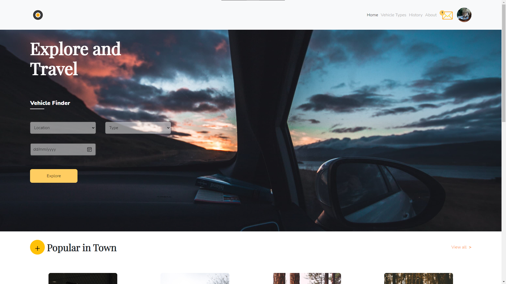
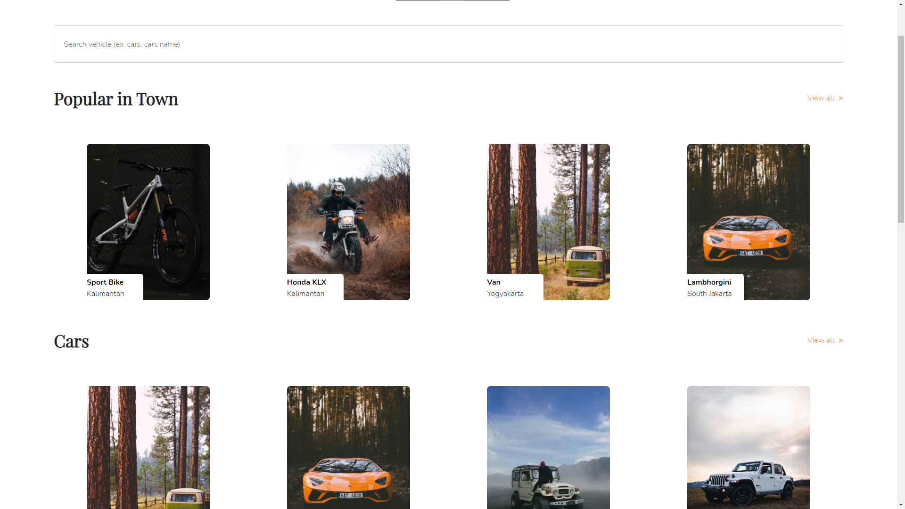
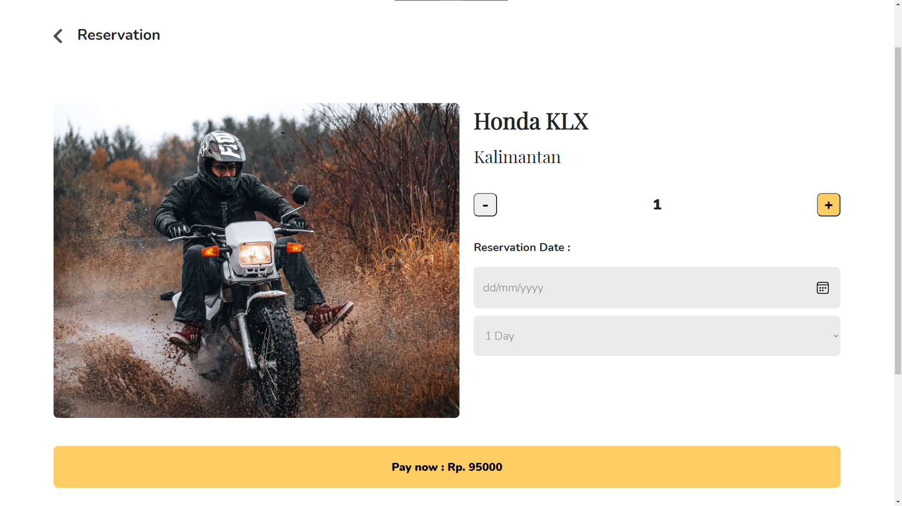
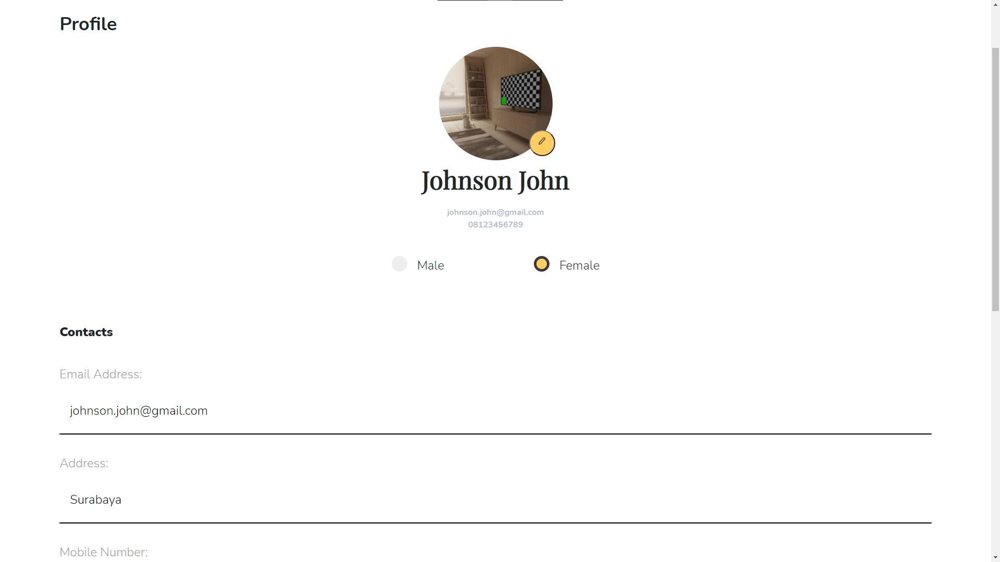

# Rental King Motor Website

This is source code for Rental King Motor website made using ReactJS. A vehicle rent app for everyone to use!


## Built With

---

[](https://reactnative.dev)

- [Node](https://nodejs.org/en/)
- [Yarn](https://yarnpkg.com/)
- 
## Deployed Website
---
You can visit the website directly [here](https://rental-king-motor.vercel.app/)

### Installaton

---

1. Download this Project or you can type

```
git clone https://github.com/sulthanqintara/React-Rental-King-Motor
```

2. To install all the dependencies package, open terminal or CMD on the app's directory and type:

```
yarn install
```

3. Add .env at the root of the project's folder

```
REACT_APP_BASE_URL = "https://rental-king-db.herokuapp.com";
```

4. Type on the terminal/CMD

```
yarn start
```

## Website's Images

---






## Available Scripts

In the project directory, you can run:

### `yarn start`

Runs the app in the development mode.\
Open [http://localhost:3000](http://localhost:3000) to view it in the browser.

### `yarn test`

Launches the test runner in the interactive watch mode.

### `yarn build`

Builds the app for production to the `build` folder.\
It correctly bundles React in production mode and optimizes the build for the best performance.

### Related Projects

---

- [Rental King Motor Backend](https://github.com/sulthanqintara/Rental-King-Motor)
- [Rental King Motor Mobile](https://github.com/sulthanqintara/rental_king_mobile)
